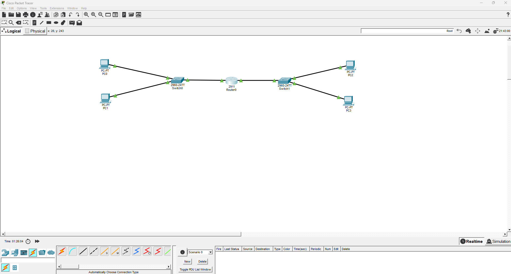
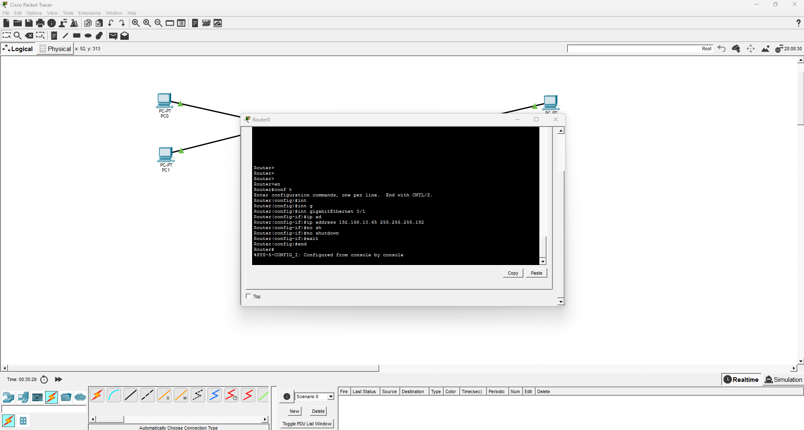
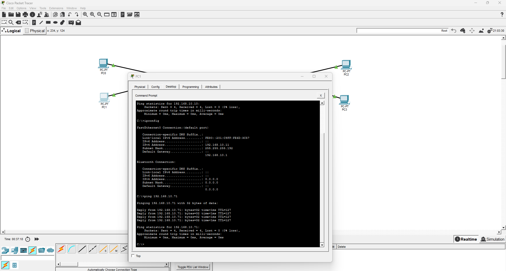

# IPv4 Network Segmentation

## Overview

This project demonstrates basic IPv4 network segmentation using Cisco Packet Tracer.

A `/24` IPv4 network was divided into smaller `/26` subnets. Two LANs were connected using a router, allowing hosts from different IPv4 networks to communicate.

The main purpose of this lab was to practice IPv4 addressing, subnet masks, default gateways, router interface configuration, and connectivity testing.

## Topology

The network contains:

- 1 Cisco 2911 Router
- 2 Cisco 2960 Switches
- 4 PCs
- Copper straight-through Ethernet connections



## IPv4 Addressing

The original network was:

`192.168.10.0/24`

For this project, `/26` subnets were used.

Subnet mask:

`255.255.255.192`

| Device | Interface | IPv4 Address | Subnet Mask | Default Gateway |
|---|---|---|---|---|
| Router0 | G0/0 | 192.168.10.1 | 255.255.255.192 | N/A |
| PC0 | Fa0 | 192.168.10.10 | 255.255.255.192 | 192.168.10.1 |
| PC1 | Fa0 | 192.168.10.11 | 255.255.255.192 | 192.168.10.1 |
| Router0 | G0/1 | 192.168.10.65 | 255.255.255.192 | N/A |
| PC2 | Fa0 | 192.168.10.70 | 255.255.255.192 | 192.168.10.65 |
| PC3 | Fa0 | 192.168.10.71 | 255.255.255.192 | 192.168.10.65 |

### LAN 1

Network: `192.168.10.0/26`

Usable host range:

`192.168.10.1 - 192.168.10.62`

Broadcast:

`192.168.10.63`

### LAN 2

Network: `192.168.10.64/26`

Usable host range:

`192.168.10.65 - 192.168.10.126`

Broadcast:

`192.168.10.127`

## Connectivity Testing and Troubleshooting
The PC0 was not communicating with PC2 when I tested the connectivity using a ping.
To fix this I checked the IP assigned to each router interface. I noticed I made a mistake assigning the IP 192.168.10.70 to interface G0/1. This address was intended to be used by PC2. I corrected the router interface to: 192.168.10.65


A second test was performed after fixing. The ping returned four successful replies with 0% packet loss.
This confirms that traffic can travel from one LAN to the router and then be routed to the second LAN.


## Router Configuration

The router connects both IPv4 networks.

Example configuration:

```text
enable
configure terminal

interface gigabitEthernet 0/0
ip address 192.168.10.1 255.255.255.192
no shutdown
exit

interface gigabitEthernet 0/1
ip address 192.168.10.65 255.255.255.192
no shutdown
exit


